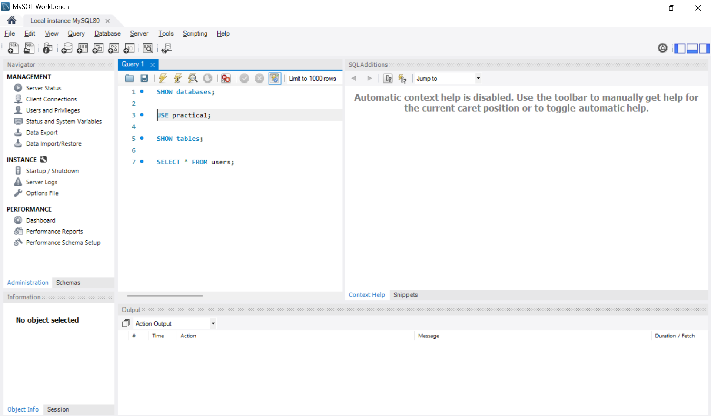
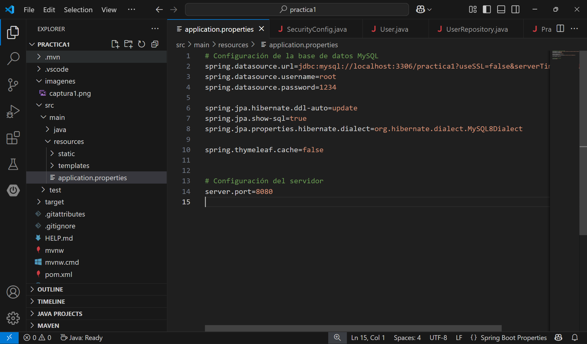
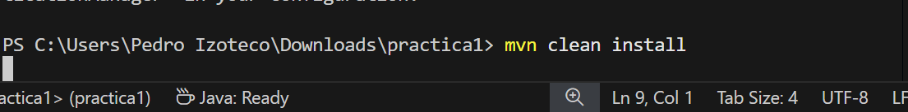
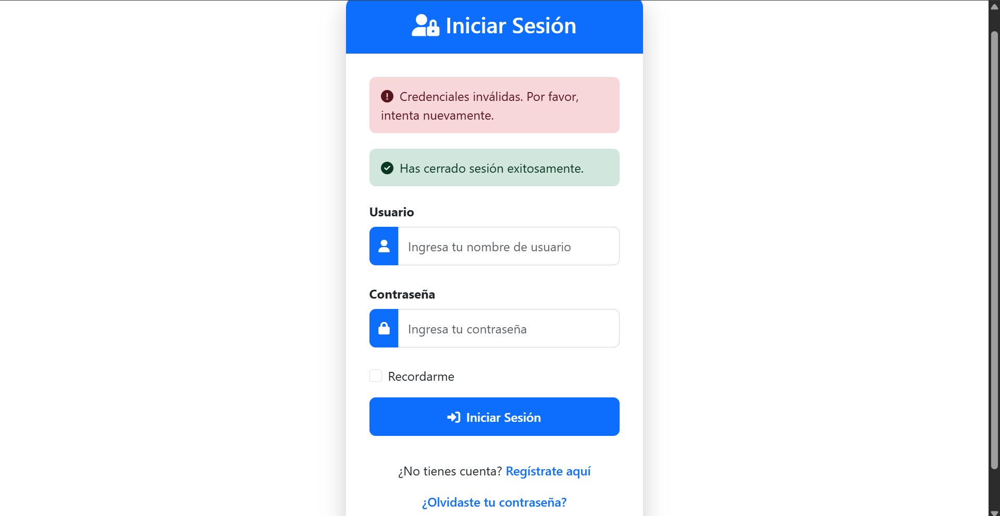
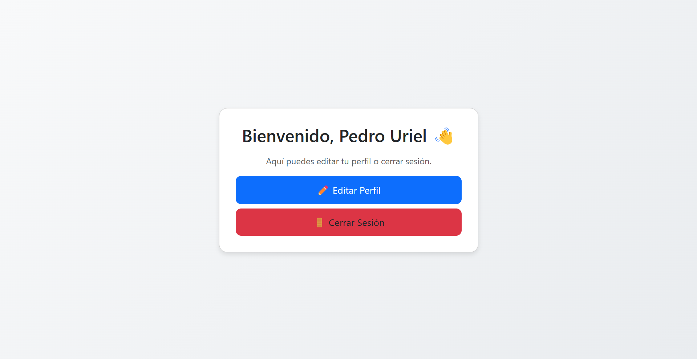
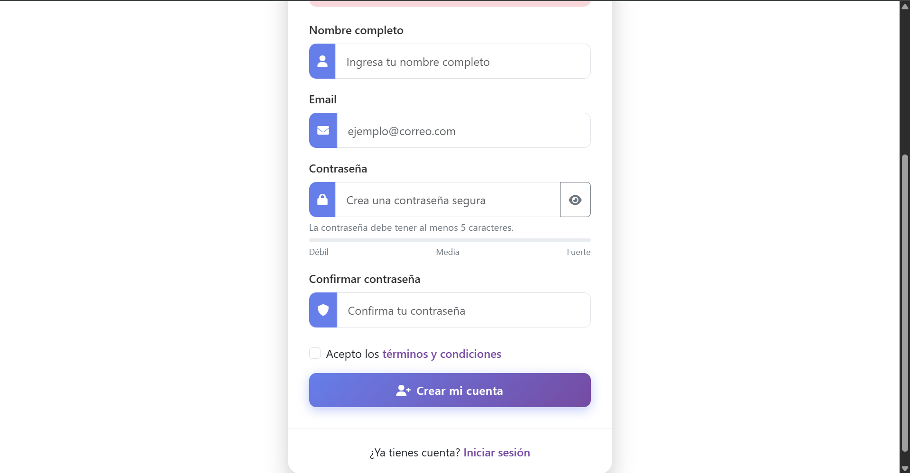
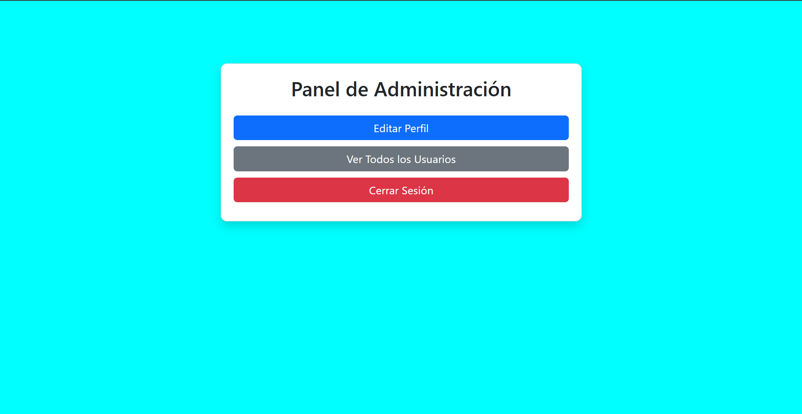
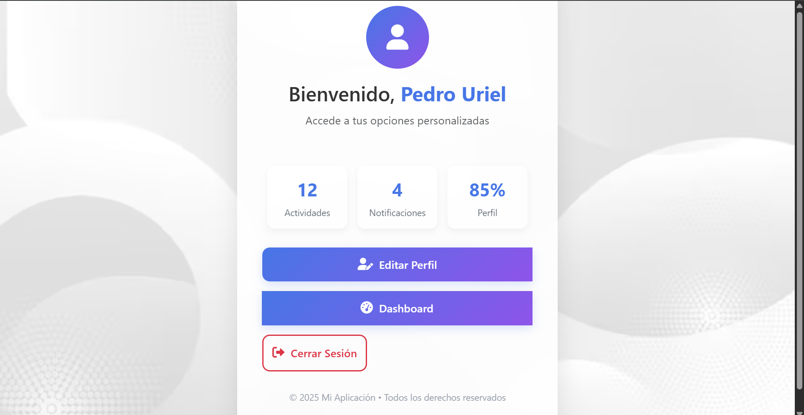

# 🛡️ Sistema de Autenticación y Registro con Spring Boot

Este proyecto es una implementación completa de un sistema de **registro y login de usuarios**, creado con **Spring Boot**, utilizando **Spring Security** para la autenticación, **JWT o sesiones**, y persistencia en una base de datos **MySQL**. Además, cuenta con una **interfaz web** sencilla desarrollada con **Thymeleaf** y una arquitectura basada en capas: controlador, servicio, repositorio y modelo.

Es ideal como práctica o base para desarrollar sistemas más complejos con roles, dashboards y seguridad avanzada.

---

## 📦 Características Principales

- Registro de usuarios con contraseña encriptada (`BCrypt`)
- Inicio de sesión con validación de credenciales
- Roles de usuario (ADMIN, USER)
- Seguridad de rutas con Spring Security
- JWT o sesiones gestionadas de forma segura
- Conexión con base de datos MySQL usando Spring Data JPA
- Interfaz web con Thymeleaf
- API REST lista para pruebas con Postman

---

## 🛠️ Tecnologías Utilizadas

- Java 21  
- Boostrap
- Spring Boot 3.4.4  
- Spring Security  
- Spring Data JPA  
- Spring Web  
- Thymeleaf  
- MySQL  
- Lombok  
- Maven  

---

## ⚙️ Instalación y Configuración

### 1. Clona el repositorio
```bash
git clone https://github.com/tu-usuario/practica1.git
cd practica1

2. Configura la base de datos
Crea una base de datos en MySQL, por ejemplo:

CREATE DATABASE practica1 CHARACTER SET utf8mb4 COLLATE utf8mb4_unicode_ci;



2. Configura tus credenciales de tu base de datos

Luego abre el archivo src/main/resources/application.properties y reemplaza con tus credenciales:

spring.datasource.url=jdbc:mysql://localhost:3306/practica1
spring.datasource.username=root
spring.datasource.password=tu_contraseña

spring.jpa.hibernate.ddl-auto=update
spring.jpa.show-sql=true
spring.jpa.properties.hibernate.dialect=org.hibernate.dialect.MySQL8Dialect



3. Comando que se ejecuta en la terminal:

mvn clean install



4. Ejecuta la aplicación

mvn spring-boot:run

4. Capturas de la aplicación funcionando.

Login





Registro



Admin



